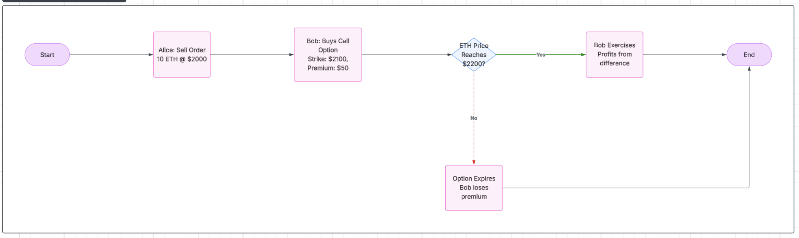
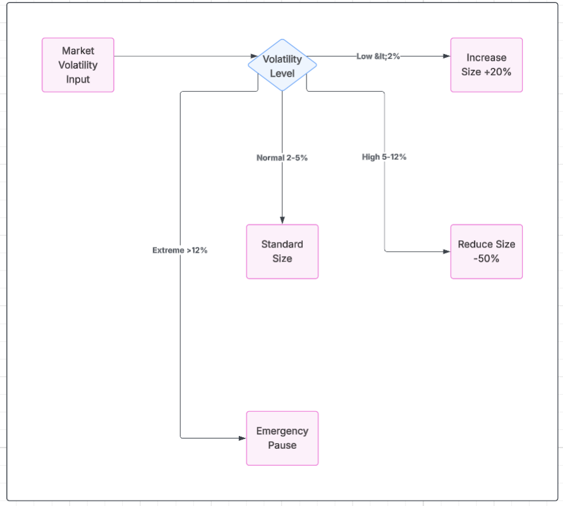
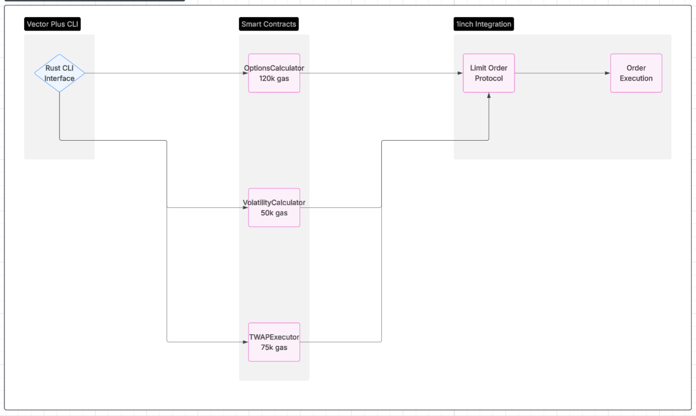
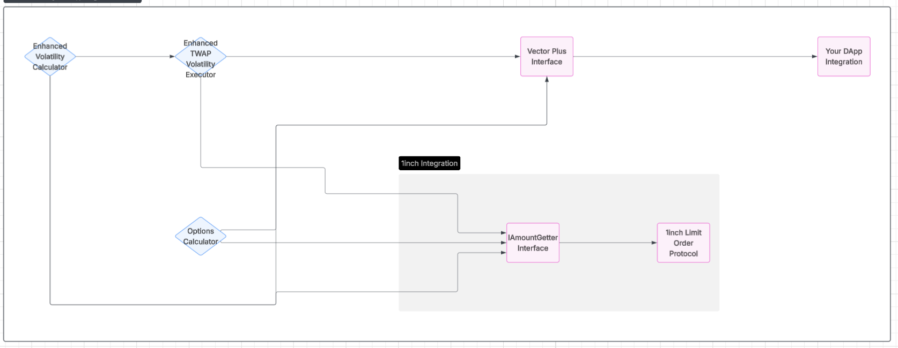

# Vector Plus: Advanced Trading Strategies for 1inch Protocol

> Revolutionary DeFi trading strategies featuring options on execution rights, volatility-aware position sizing, and MEV-resistant TWAP execution.

[](https://opensource.org/licenses/MIT)
[](https://docs.soliditylang.org/)
[](https://getfoundry.sh/)

## What We Built

### 1. Options on Execution Rights (Industry First)
Trade options on the **right to execute** limit orders, not the underlying assets.



**How it works:**
1. **Order Creation**: Alice creates a limit order to sell 10 ETH at $2000 each
2. **Option Purchase**: Bob pays $50 premium for a call option with $2100 strike price
3. **Market Movement**: ETH price moves in the market
4. **Exercise Decision**: If ETH > $2100, Bob can exercise during the 30-minute window before expiration
5. **Profit/Loss**: Bob profits from the price difference minus premium, or loses the premium if not exercised

**Key Innovation**: Unlike traditional options on assets, these are options on the **execution right** of existing limit orders.

### 2. Volatility-Aware Position Sizing
Dynamic execution sizing based on real-time market volatility.



**How it works:**
1. **Volatility Input**: Real-time market volatility is fed into the system (measured in basis points)
2. **Risk Assessment**: Algorithm calculates risk score (0-1000) based on current vs baseline volatility
3. **Size Adjustment**:
   - **Low volatility (<2%)**: Increase execution size by up to 50% (safer to execute larger amounts)
   - **Normal volatility (2-5%)**: Standard execution size
   - **High volatility (5-12%)**: Reduce execution size by up to 50% (risk management)
   - **Extreme volatility (>12%)**: Emergency pause - no execution allowed
4. **Bounds Enforcement**: Final amount respects min/max execution limits
5. **Conservative Mode**: Optional additional 10% reduction for extra safety

**Example**: 2.0 ETH order with 8% volatility → 1.0 ETH execution (50% reduction due to high volatility)

### 3. MEV-Resistant TWAP Execution
Time-weighted execution with anti-MEV randomization.

**How it works:**
1. **TWAP Setup**: User defines total duration (e.g., 2 hours) and intervals (e.g., 12 intervals = 10 min each)
2. **Base Calculation**: Order divided equally across intervals (10 ETH ÷ 12 intervals = 0.83 ETH per interval)
3. **Randomization Layer**: Each execution gets ±15% random adjustment to prevent MEV bots from predicting timing
4. **Volatility Integration**: High volatility → shorter intervals for faster execution, Low volatility → longer intervals
5. **Execution**: System executes randomly-sized portions at adaptive intervals
6. **Progress Tracking**: Monitor completion percentage and remaining amounts

**MEV Protection Features:**
- **±15% randomization** prevents predictable execution patterns
- **Adaptive intervals** - shorter during high volatility for faster execution
- **Deterministic randomness** using order hash + timestamp (unpredictable but verifiable)
- **Progress tracking** with emergency controls for extreme market conditions

**Example**: 12 ETH order over 2 hours → 12 intervals with 0.85-1.15 ETH per interval, executed every 8-12 minutes depending on volatility

## System Architecture



## Quick Start

```bash
# Setup everything
git clone https://github.com/your-repo/vector-plus.git
cd vector-plus
./setup.sh

# Create volatility strategy
./cli/target/release/vector-plus volatility create-config \
  --current-volatility 750 \
  --conservative-mode

# Create TWAP strategy
./cli/target/release/vector-plus twap create-config \
  --duration 120 \
  --intervals 12 \
  --randomize

# Run tests
forge test
./test-suite.sh --fork
```

## Key Features

### Revolutionary Options System
- **First-ever options on limit order execution rights**
- Call/put options with strike prices and expiration times
- 30-minute exercise window before expiration
- Premium collection with protocol fees

### Intelligent Risk Management
- **Real-time volatility analysis** with 0-1000 risk scoring
- **Emergency pause mechanisms** for extreme market conditions
- **Progressive position sizing** based on market conditions

### MEV Protection
- **±15% execution randomization** prevents predictable patterns
- **Adaptive intervals** adjust based on volatility
- **Time-weighted distribution** reduces market impact

## Smart Contract Architecture

### Core Strategy Contracts

| Contract | Purpose | Gas Cost | Dependencies |
|----------|---------|----------|--------------|
| `EnhancedVolatilityCalculator` | Volatility-aware position sizing | ~50k gas | None (standalone) |
| `EnhancedTWAPVolatilityExecutor` | TWAP + volatility execution | ~75k gas | VolatilityCalculator |
| `OptionsCalculator` | Options on execution rights | ~120k gas | None (standalone) |
| `VectorPlusInterface` | Unified interface for all strategies | Variable | All above contracts |

### Contract Dependencies


### How Smart Contracts Work Together

**1. Independent Strategy Contracts:**
- `EnhancedVolatilityCalculator` - Standalone volatility analysis
- `OptionsCalculator` - Standalone options trading
- Both implement `IAmountGetter` for direct 1inch integration

**2. Combined Strategy Contract:**
- `EnhancedTWAPVolatilityExecutor` - Combines TWAP with volatility analysis
- **Depends on:** `EnhancedVolatilityCalculator` (constructor parameter)
- Calls volatility calculator for risk assessment and position sizing

**3. Unified Interface Contract:**
- `VectorPlusInterface` - Single entry point for all functionality
- **Depends on:** All three strategy contracts (constructor parameters)
- Provides batch operations, gas estimation, and unified API

### Integration Interface

```solidity
// Main interface for integrating Vector Plus
interface IVectorPlusInterface {
    // Volatility Strategy
    function calculateVolatilityAmount(uint256 baseAmount, VolatilityData memory volData) 
        external view returns (uint256 adjustedAmount);
    
    // TWAP Strategy  
    function calculateTWAPAmount(Order memory order, bytes32 orderHash, uint256 requestedAmount, 
        uint256 remainingAmount, CombinedStrategyData memory combinedData) 
        external view returns (uint256 executionAmount);
    
    // Options Strategy
    function createCallOption(Order memory order, bytes32 orderHash, uint256 strikePrice, 
        uint256 expiration, uint256 premium) 
        external payable returns (bytes32 optionId);
    
    function createPutOption(Order memory order, bytes32 orderHash, uint256 strikePrice, 
        uint256 expiration, uint256 premium) 
        external payable returns (bytes32 optionId);
    
    // Utility Functions
    function batchCalculateVolatility(uint256[] memory amounts, VolatilityData memory volData) 
        external view returns (uint256[] memory adjustedAmounts);
    
    function estimateGasCost(string memory strategyType) 
        external pure returns (uint256 gasEstimate);
}
```

### Deployment Order

```bash
# 1. Deploy independent contracts
forge create EnhancedVolatilityCalculator
forge create OptionsCalculator --constructor-args $FEE_COLLECTOR

# 2. Deploy dependent contract
forge create EnhancedTWAPVolatilityExecutor --constructor-args $VOLATILITY_CALCULATOR_ADDRESS

# 3. Deploy unified interface
forge create VectorPlusInterface --constructor-args $VOLATILITY_CALC $TWAP_EXECUTOR $OPTIONS_CALC

# 4. Use deployment script for automated deployment
./deploy.sh mainnet --verify
```

All contracts implement the 1inch `IAmountGetter` interface for seamless integration.

## Testing & Validation

- **95+ unit tests** covering all strategy logic
- **54 mainnet fork tests** with real market data (WETH, USDC, USDT)
- **Live price feeds** from Ethereum mainnet
- **Multi-network validation** on 5+ EVM chains

## Usage Examples

### Volatility Strategy
```bash
# High volatility market - reduce position size
vector-plus volatility create-config \
  --current-volatility 900 \
  --conservative-mode \
  --max-execution-size 2.0

# Calculate adjusted amount
vector-plus volatility calculate --amount 5.0 --config strategy.json
# Output: 2.5 ETH (50% reduction due to high volatility)
```

### TWAP Strategy
```bash
# 6-hour execution with MEV protection
vector-plus twap create-config \
  --duration 360 \
  --intervals 36 \
  --randomize

# Simulate execution
vector-plus twap simulate --order-size 20.0 --config twap.json
```

### Options Strategy
```bash
# Create call option for bullish bet
vector-plus options create-call \
  --strike-price 2200 \
  --expiration-hours 168 \
  --premium 65

# Calculate fair premium
vector-plus options premium \
  --current-price 2000 \
  --strike-price 2200 \
  --time-to-expiration 168
```

## Network Support

- **Ethereum Mainnet** - Primary deployment
- **Polygon** - L2 for lower fees
- **Arbitrum** - Optimistic rollup
- **Base** - Coinbase L2
- **Optimism** - Ethereum L2

## Performance Metrics

| Strategy | Gas Usage | Execution Time | Risk Reduction |
|----------|-----------|----------------|----------------|
| Volatility Management | ~50k gas | <1 second | Up to 50% size reduction |
| TWAP Execution | ~75k gas | Configurable intervals | MEV protection via randomization |
| Options Trading | ~120k gas | 30-min exercise window | Premium-based risk transfer |

## Documentation

- **[CLI Guide](./docs/CLI.md)** - Complete command reference
- **[Testing Guide](./docs/TESTING.md)** - Running tests and validation
- **[API Reference](./src/)** - Smart contract documentation

## License

MIT License - see [LICENSE](LICENSE) file for details.

---

**Vector Plus** - Advancing DeFi trading through intelligent automation and risk management.